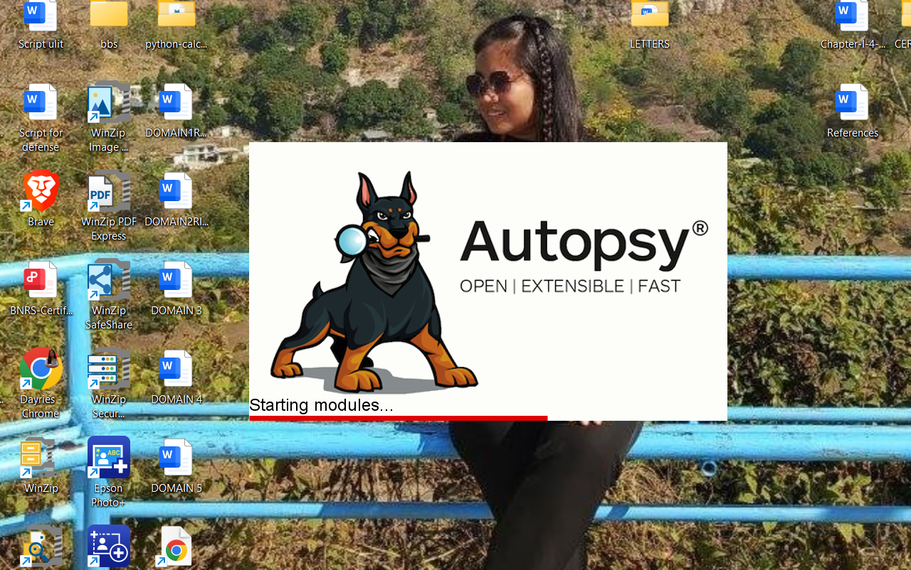
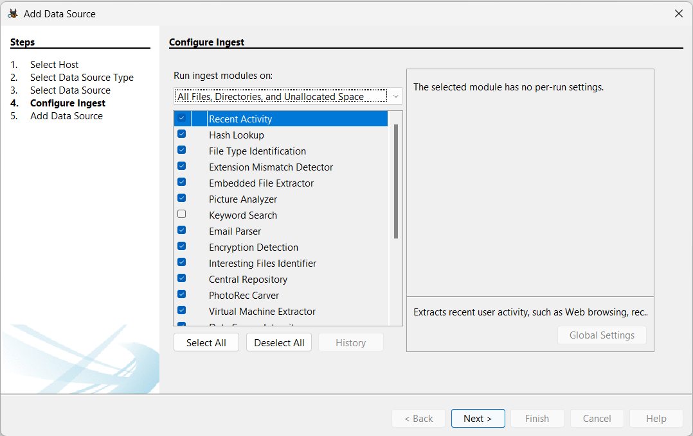
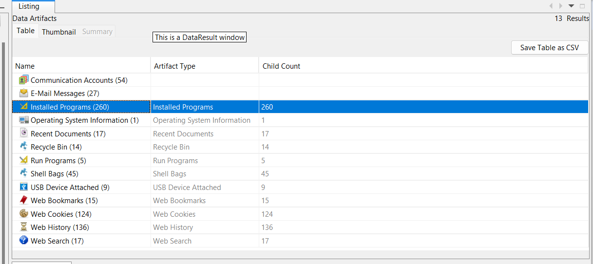
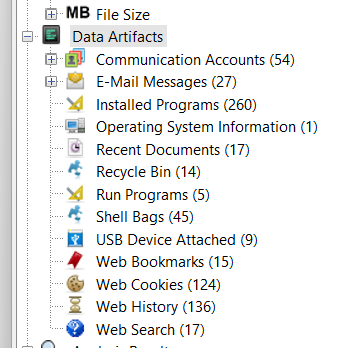
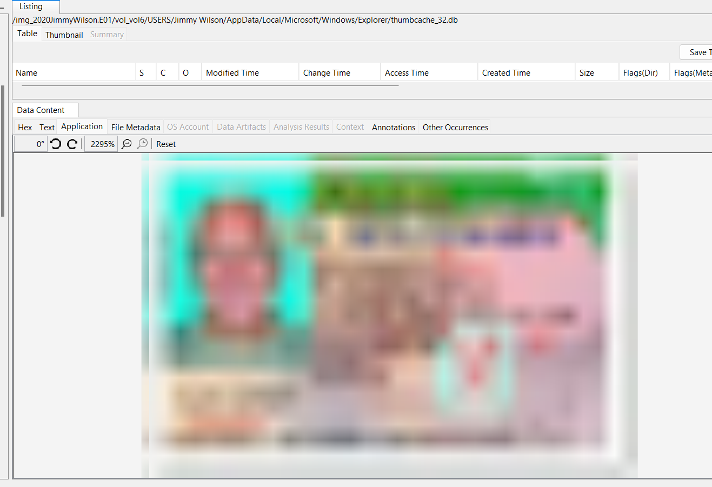

# Autopsy Digital Forensics Investigation

## Objective

Perform a basic digital forensic investigation using Autopsy to analyze a Windows system image, identify digital artifacts, and recover forensic evidence.

---

## Lab Environment

- Windows 10
- Autopsy Digital Forensics Platform
- Windows Disk Image

---

## Tools Used

- Autopsy
- Windows Operating System

---

## Autopsy Home

The Autopsy Digital Forensics Platform was launched to begin the forensic investigation and create a new case.

---

## Configure Ingest Modules

Ingest modules were configured to process the evidence source and automatically extract forensic artifacts such as web history, installed applications, user accounts, and thumbnail cache.

---

## Installed Programs

The installed applications on the Windows system were examined to identify software that may be relevant to the investigation or indicate suspicious activity.

---

## Artifacts of Interest

Autopsy identified multiple forensic artifacts, including user activity, operating system information, and other evidence that may assist investigators during forensic analysis.

---

## Recovered Thumbnail

Autopsy successfully recovered a cached thumbnail from the Windows thumbnail cache. Even if the original image has been deleted, thumbnail cache artifacts can remain and provide valuable forensic evidence.

---

## Findings

- Successfully created a forensic investigation using Autopsy.
- Configured ingest modules for automated evidence processing.
- Identified installed software on the target system.
- Examined Windows forensic artifacts.
- Recovered thumbnail cache evidence from the Windows system.

---

## Skills Demonstrated

- Digital Forensics
- Windows Artifact Analysis
- Evidence Collection
- Incident Investigation
- Autopsy Digital Forensics
- Digital Evidence Recovery

---

## Conclusion

This laboratory exercise demonstrates the use of Autopsy to perform a basic digital forensic investigation. The examination successfully identified installed applications, analyzed Windows forensic artifacts, and recovered thumbnail cache evidence. These findings illustrate how digital forensic tools support incident response, evidence collection, and forensic investigations.