# Metasploitable 2 VSFTPD 2.3.4 Exploitation Lab using Metasploit

## Overview

This project demonstrates a complete penetration testing workflow using Kali Linux and Metasploitable in a controlled virtual lab environment. The goal of the lab was to identify a vulnerable service, exploit it using the Metasploit Framework, gain remote access to the target machine, and perform basic post-exploitation enumeration.

> **Disclaimer:** This lab was performed in a controlled environment using the intentionally vulnerable Metasploitable virtual machine for educational purposes only.

---

# Lab Environment

| Machine | Role |
|----------|------|
| Kali Linux | Attacker |
| Metasploitable | Target |
| VMware Workstation | Virtualization Platform |
| Host-Only Network | Network Configuration |

---

# Tools Used

- Kali Linux
- Nmap
- SearchSploit
- Metasploit Framework
- Meterpreter
- Linux Terminal

---

# Objectives

- Verify network connectivity between the attacker and target.
- Enumerate open ports and running services.
- Identify vulnerable software versions.
- Research available exploits.
- Exploit the VSFTPD 2.3.4 backdoor vulnerability.
- Obtain a Meterpreter session.
- Gain root access.
- Perform post-exploitation enumeration.

---

# Lab Workflow

```
Network Setup
      ↓
Connectivity Test
      ↓
Service Enumeration
      ↓
Vulnerability Identification
      ↓
Exploitation
      ↓
Meterpreter Session
      ↓
Root Access
      ↓
Post-Exploitation Enumeration
```

---

# Lab Walkthrough

## Figure 1 – Kali Linux Network Configuration

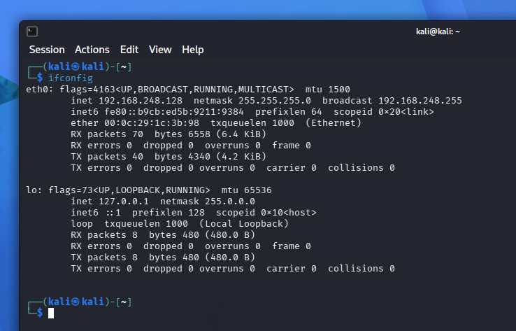

The IP address of the Kali Linux attacker machine was verified before starting the penetration test.

---

## Figure 2 – Metasploitable 2 Network Configuration

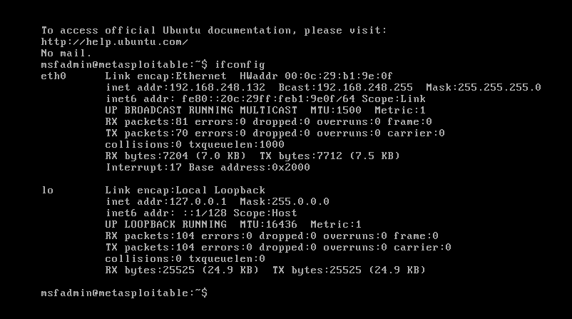

The target machine's IP address was verified to ensure both virtual machines were on the same Host-Only network.

---

## Figure 3 – Connectivity Verification

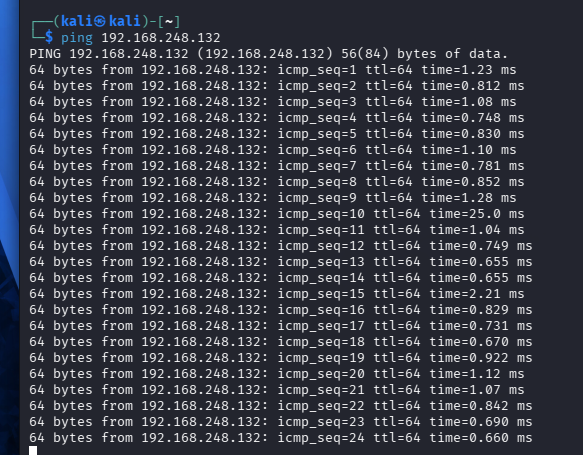

A successful ping test confirmed communication between Kali Linux and the Metasploitable 2 virtual machine.

---

## Figure 4 – Service Enumeration

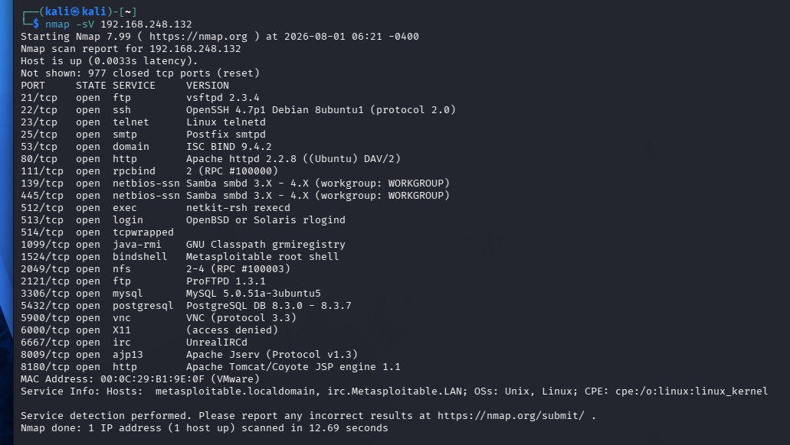

Nmap service version detection identified multiple open ports and services, including the vulnerable VSFTPD 2.3.4 FTP service.

---

## Figure 5 – Vulnerability Research

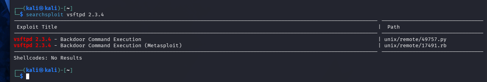

SearchSploit was used to verify that a public exploit exists for VSFTPD version 2.3.4.

---

## Figure 6 – Launching Metasploit

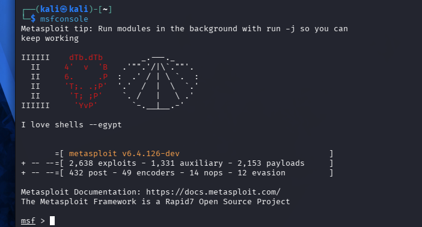

The Metasploit Framework was launched to begin the exploitation phase.

---

## Figure 7 – Searching for the Exploit Module

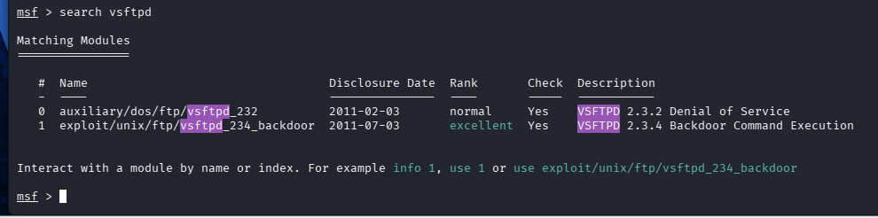

The appropriate Metasploit module for the VSFTPD 2.3.4 backdoor vulnerability was identified.

---

## Figure 8 – Loading the Exploit Module

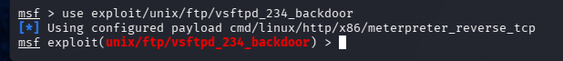

The VSFTPD 2.3.4 Backdoor Command Execution exploit module was loaded into Metasploit.

---

## Figure 9 – Reviewing Exploit Options

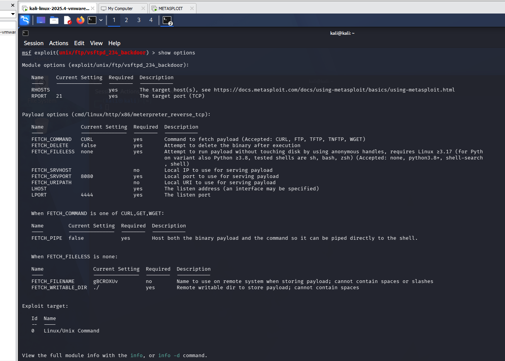

The available exploit and payload options were reviewed before configuring the attack.

---

## Figure 10 – Configuring the Target

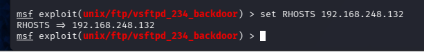

The target IP address (RHOSTS) was configured for the exploit.

---

## Figure 11 – Verifying the Configuration

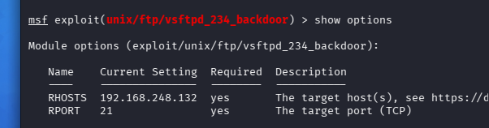

The exploit configuration was reviewed to ensure the required options were properly configured.

---

## Figure 12 – Configuring the Attacker

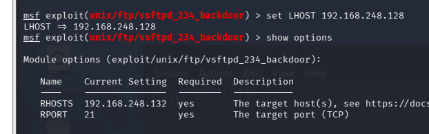

The attacker IP address (LHOST) was configured for the reverse Meterpreter payload.

---

## Figure 13 – Successful Exploitation

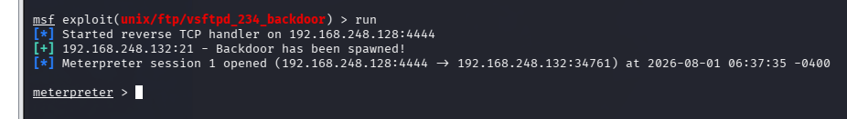

The exploit successfully established a Meterpreter session with the target machine.

---

## Figure 14 – Active Meterpreter Session

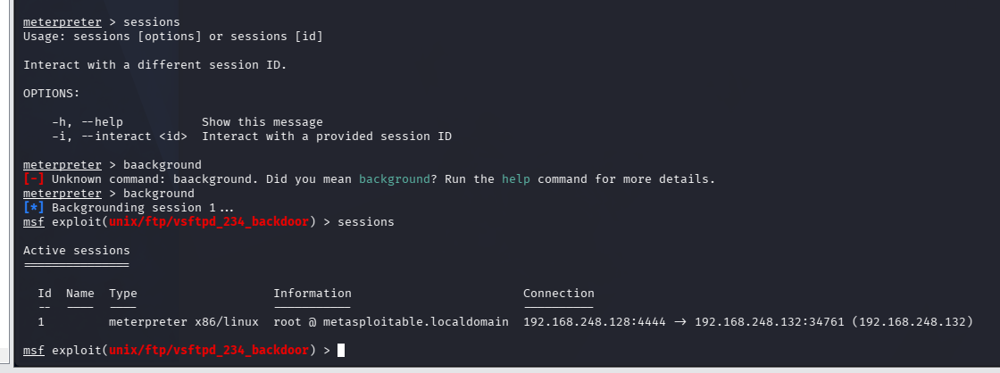

The active Meterpreter session was verified before interacting with the compromised system.

---

## Figure 15 – Reconnecting to the Session

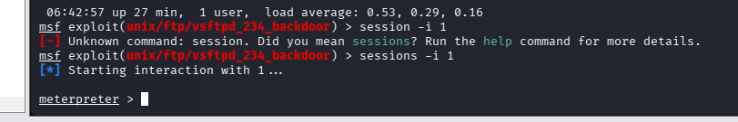

The existing Meterpreter session was reopened to continue post-exploitation activities.

---

## Figure 16 – Privilege Verification

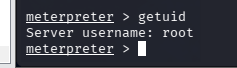

The `getuid` command confirmed that the Meterpreter session was running with root privileges.

---

## Figure 17 – System Information

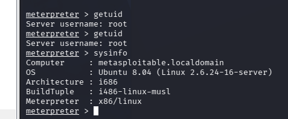

System information such as the operating system, architecture, and hostname was collected using Meterpreter.

---

## Figure 18 – Interactive Root Shell

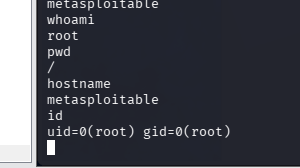

A standard Linux shell was launched from Meterpreter, confirming successful root-level access.

---

## Figure 19 – Operating System Enumeration

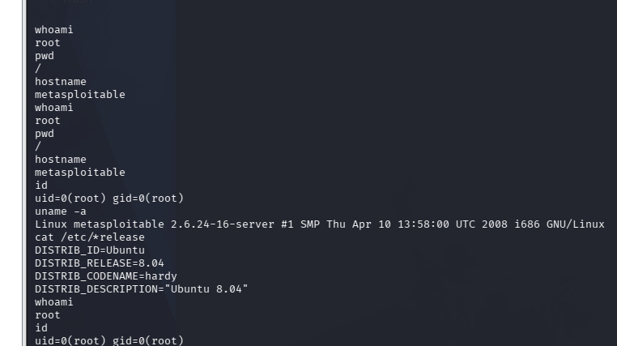

Commands such as `uname -a` and `cat /etc/*release` were used to identify the Linux kernel version and operating system information.

---

## Figure 20 – Running Process Enumeration

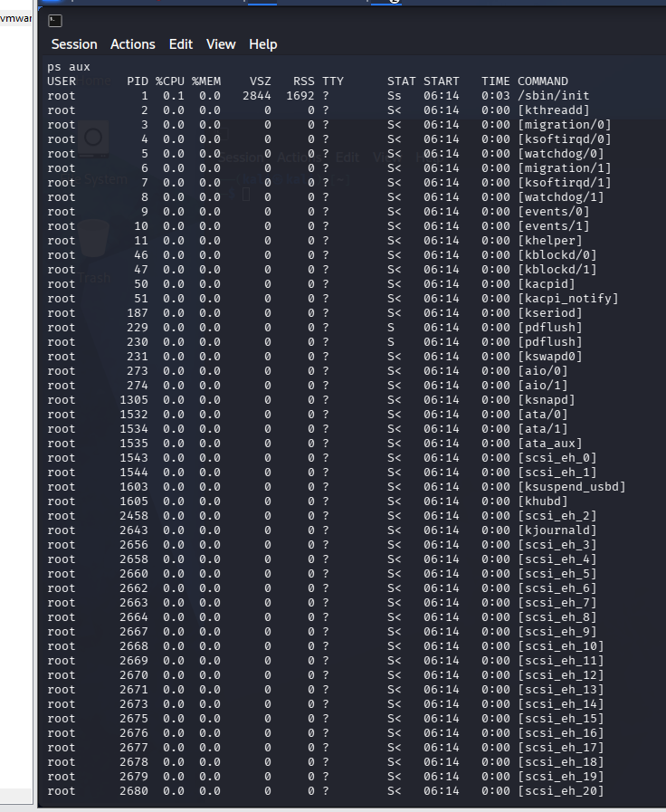

The `ps aux` command was used to enumerate active processes running on the compromised system.

---

## Figure 21 – Running Process Enumeration (Continuation)

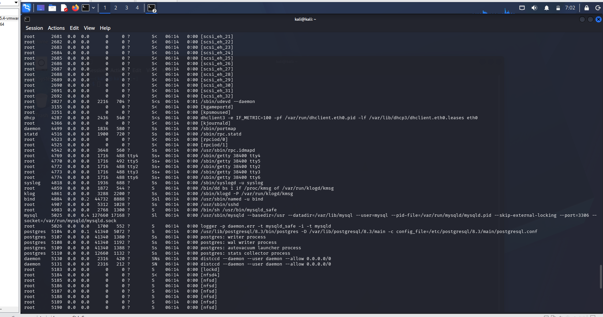

Additional running services and background processes were reviewed.

---

## Figure 22 – Network Service Enumeration

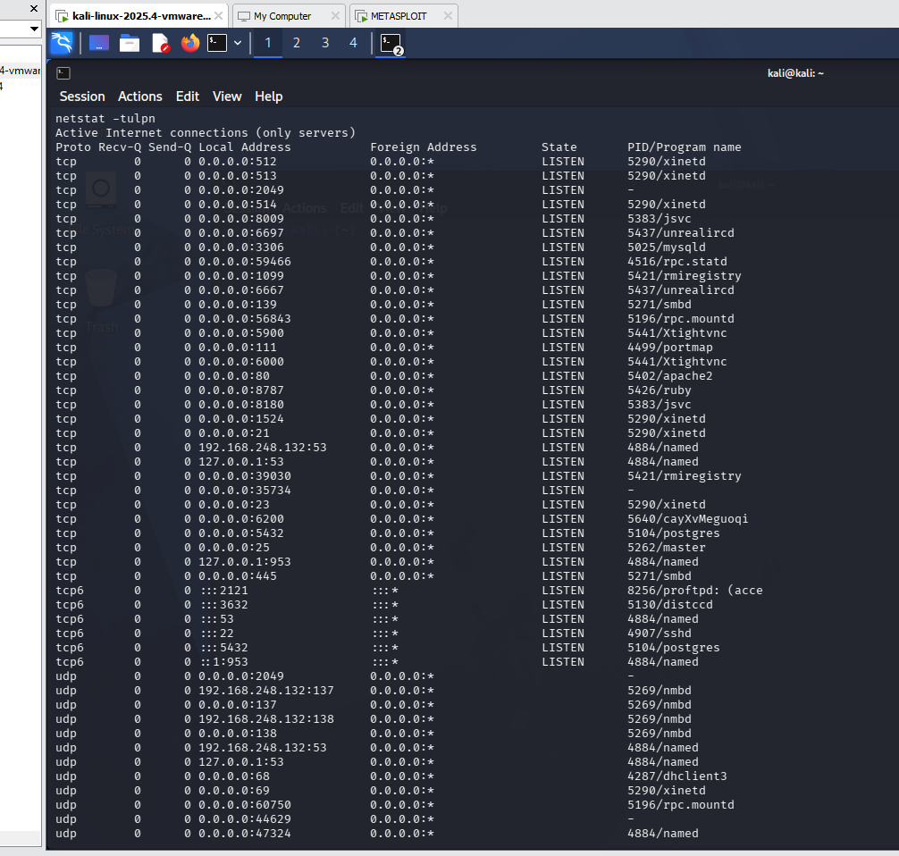

The `netstat -tulpn` command identified active network services and listening ports.

---

## Figure 23 – Filesystem Enumeration

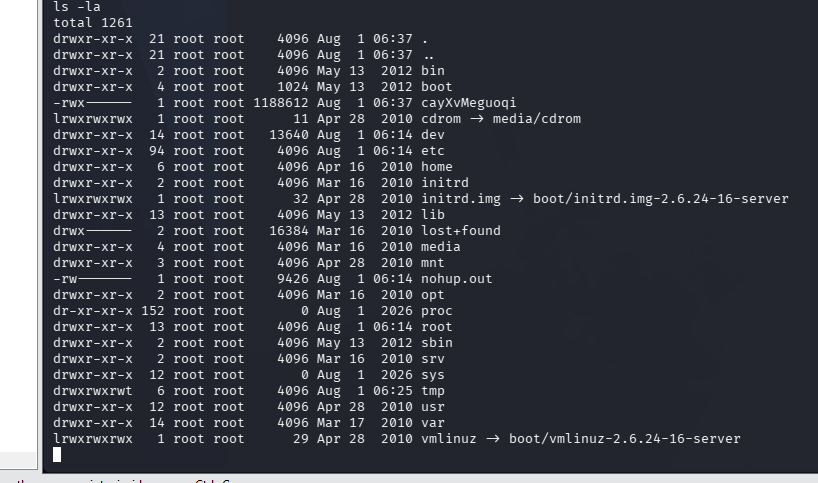

The contents and permissions of the current directory were examined using `ls -la`.

---

## Figure 24 – Root Directory Structure

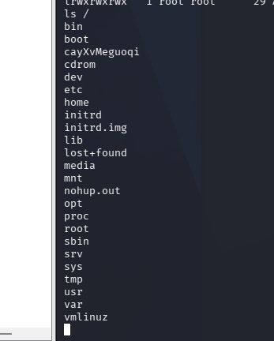

The top-level Linux directory structure was displayed after obtaining root access.

---

## Figure 25 – User Enumeration

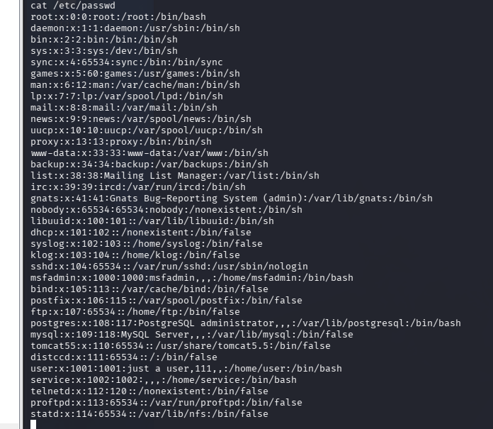

The `/etc/passwd` file was examined to enumerate local user accounts.

---

## Figure 26 – Group Enumeration (Part 1)

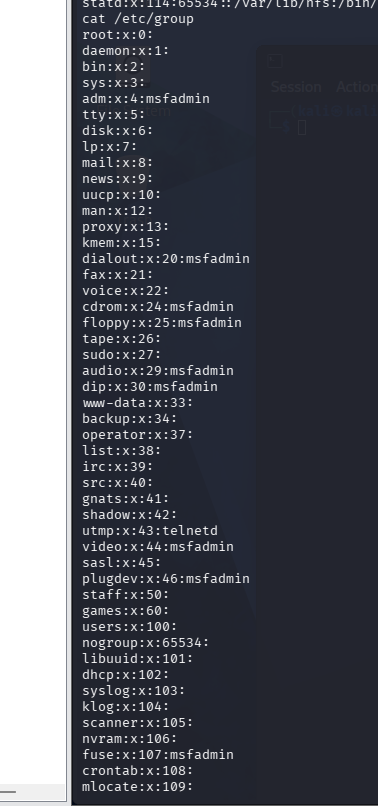

The `/etc/group` file was examined to identify local groups configured on the system.

---

## Figure 27 – Group Enumeration (Part 2)

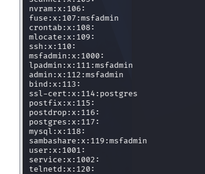

Additional local groups and memberships were reviewed.

---

## Figure 28 – Scheduled Task Enumeration Attempt

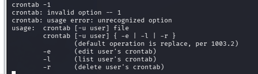

An attempt was made to list scheduled tasks using the `crontab` command. The output indicated incorrect syntax, which was corrected in the next step.

---

## Figure 29 – System Crontab Enumeration

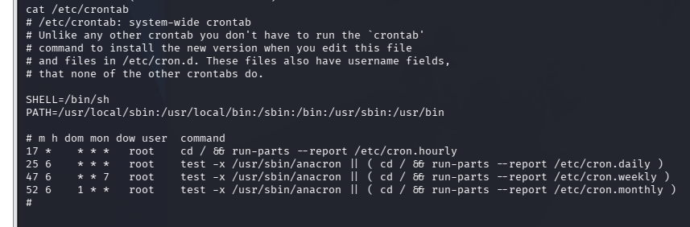

The system-wide crontab configuration was examined to identify scheduled tasks.

---

# Key Findings

- Verified communication between Kali Linux and Metasploitable 2.
- Identified the vulnerable VSFTPD 2.3.4 FTP service.
- Confirmed the availability of a public exploit using SearchSploit.
- Successfully exploited the vulnerability using Metasploit.
- Established a Meterpreter session.
- Obtained root-level access.
- Performed post-exploitation enumeration of the target system.

---

# Skills Demonstrated

- Network Reconnaissance
- Service Enumeration
- Vulnerability Assessment
- Exploit Research
- Metasploit Framework
- Meterpreter
- Linux Enumeration
- Post-Exploitation
- Basic Penetration Testing

---

# Conclusion

This lab successfully demonstrated the exploitation of the VSFTPD 2.3.4 backdoor vulnerability on Metasploitable 2 using the Metasploit Framework. After establishing a Meterpreter session and obtaining root-level access, several post-exploitation techniques were performed to gather system information, inspect running services, enumerate users and groups, and review scheduled tasks. The exercise reinforced the importance of proper enumeration, vulnerability validation, and understanding the impact of outdated software in a controlled penetration testing environment.