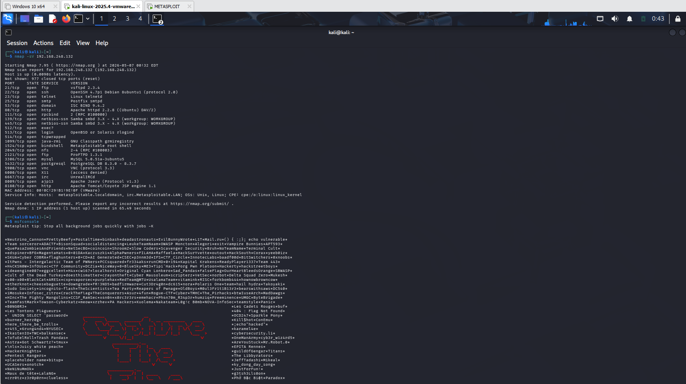
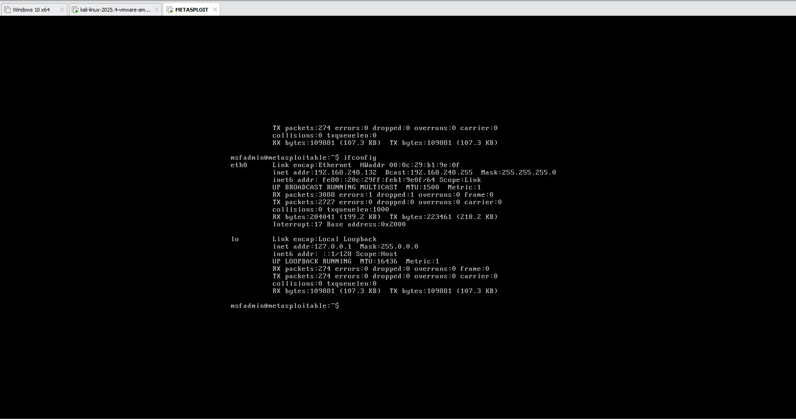

# Metasploitable Exploitation Lab

## Setup

- Kali Linux (Attacker)
- Metasploitable 2 (Target)
- Host-Only Network

## Scanning

**Command**

```bash
nmap -sV 192.168.248.132
```

**Result**



## Exploitation

**Exploit Used**

`vsftpd_234_backdoor`

**Result**


## Victim Machine

Metasploitable shell after successful exploitation.



## Conclusion

The target was successfully enumerated using Nmap, revealing multiple exposed services including a vulnerable VSFTPD 2.3.4 FTP server. The identified vulnerability was exploited in the lab environment, resulting in successful shell access to the Metasploitable 2 virtual machine. This exercise demonstrates the importance of identifying exposed services, validating vulnerabilities, and understanding the risks associated with outdated software.
