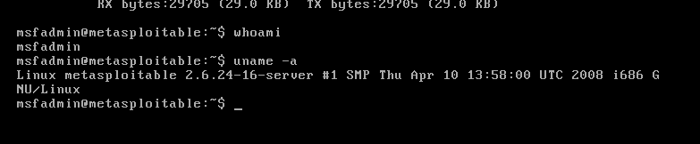
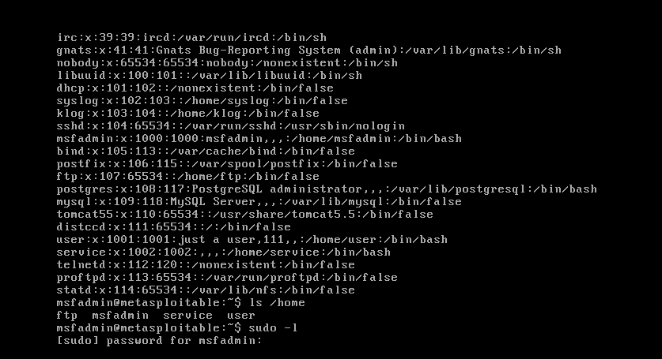
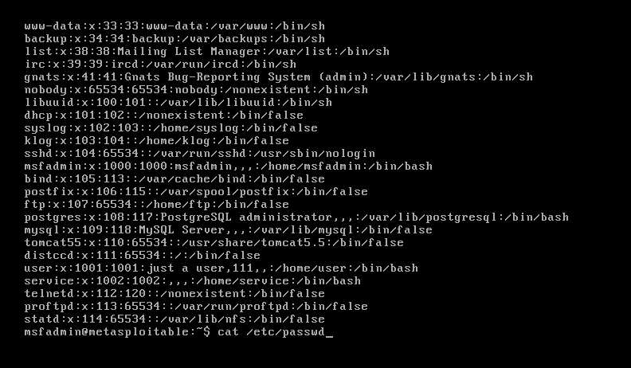
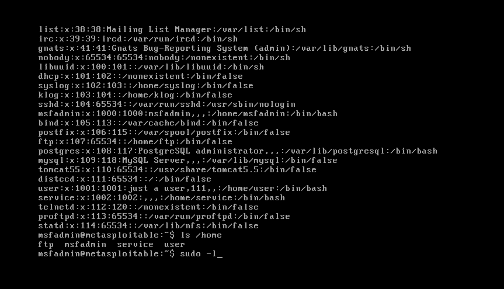

### Victim Terminal (Metasploitable shell)

- Command: `whoami`
- Result: msfadmin

- Command: `uname -a`
- Result: Linux metasploitable 2.6.24-16-server ...

- Command: `cat /etc/passwd`
- Result: Screenshot of user accounts

- Command: `sudo -l`
- Result: Screenshot of sudo privileges

