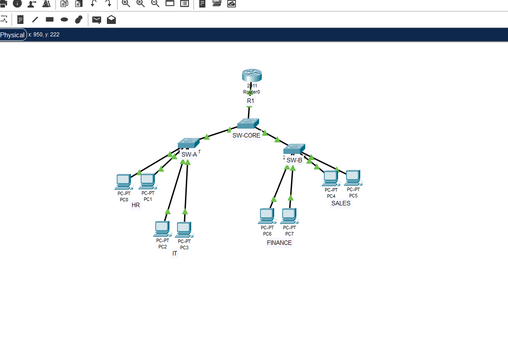
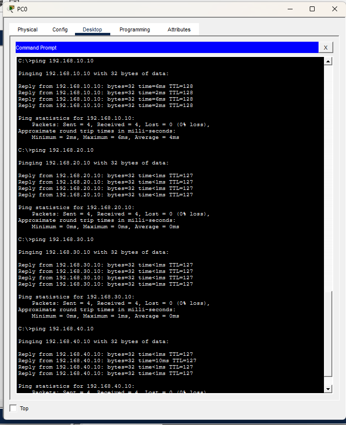

# Enterprise Network Lab

## Overview

This project demonstrates an enterprise network designed in Cisco Packet Tracer using VLANs, VLAN Trunking, and Router-on-a-Stick.

## Network Topology

- Cisco 2911 Router
- Core Switch
- Access Switch A
- Access Switch B

## VLANs

| VLAN | Department | Network |
|------|------------|----------------|
|10|HR|192.168.10.0/24|
|20|IT|192.168.20.0/24|
|30|Finance|192.168.30.0/24|
|40|Sales|192.168.40.0/24|

## Features

- VLAN Configuration
- 802.1Q Trunking
- Router-on-a-Stick
- Inter-VLAN Routing
- Static IP Addressing

## Network Topology

## Inter-VLAN Ping Test

## Author

Created as a Cisco Packet Tracer networking laboratory project.