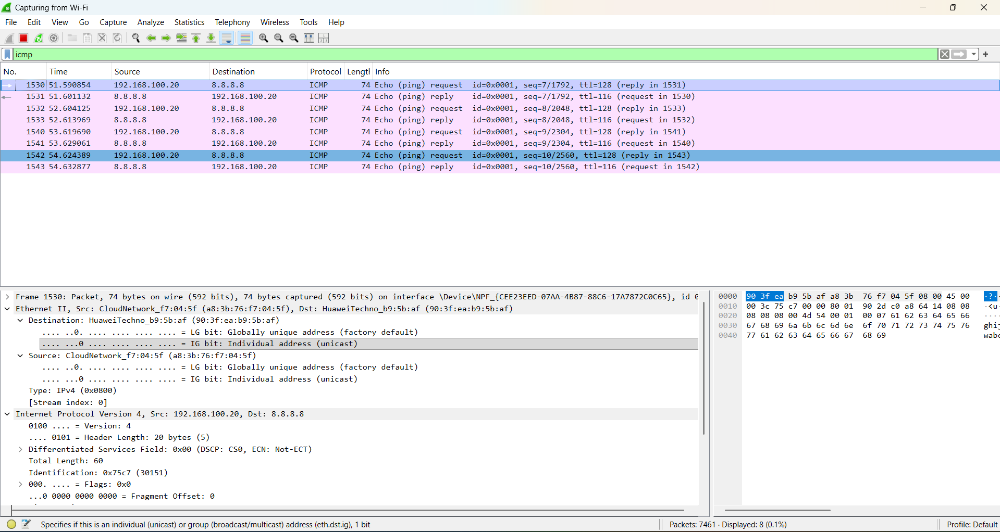
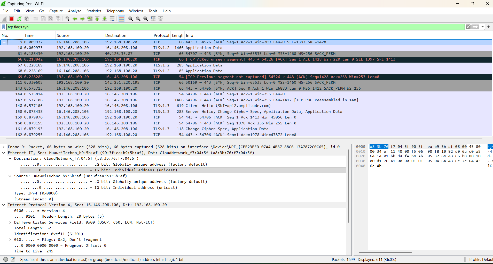
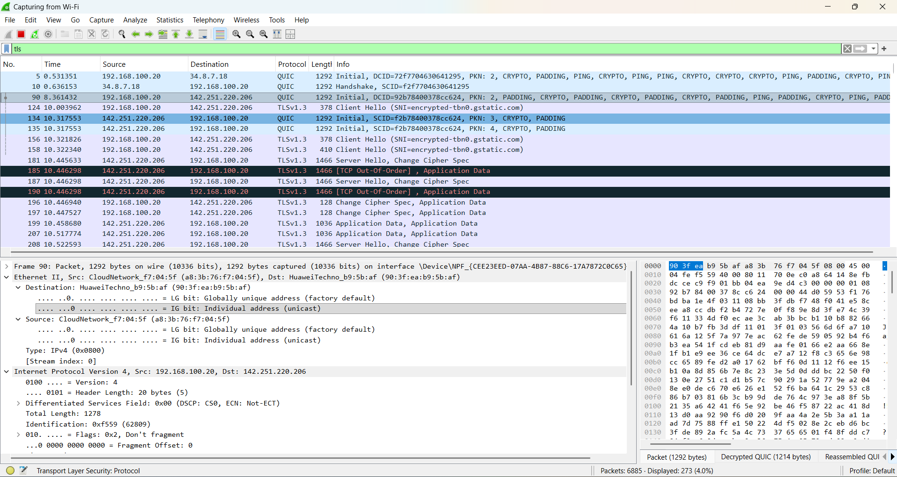

# Day 4 – OSI & TCP/IP Traffic Analysis using Wireshark

## Objective
To capture and analyze network traffic using **Wireshark** and identify how protocols function under the **OSI** and **TCP/IP** models.

---

## 1) ICMP Analysis (Ping Test)

### Observations
- **Source IP:** 192.168.100.20  
- **Destination IP:** 8.8.8.8  
- **Protocol:** ICMP  
- **Message Type:** Echo Request / Echo Reply  

### Analysis
The ICMP Echo Request was sent from my device (**192.168.100.20**) to Google DNS server (**8.8.8.8**).  
The Echo Reply confirms successful connectivity between the source and destination.

---

## 2) DNS Analysis (Name Resolution)

### Observations
- **Source IP:** 192.168.100.20  
- **Destination IP:** 192.168.100.1 (DNS Server)  
- **Protocol:** DNS  
- **Transport Protocol:** UDP (Port 53)  
- **Query:** play.google.com (example)  
- **Response:** Returned IPv4 address  

### Analysis
The DNS packet capture shows the domain name resolution process.  
A DNS query was sent from the local device to the DNS server to resolve the domain name into an IP address.  
The DNS response provided the corresponding IP address, allowing communication with the target server.

---

## 3) TCP 3-Way Handshake (Connection Establishment)

### Observations
- **Source Port:** Random (client side)  
- **Destination Port:** 443 (HTTPS)  
- **Protocol:** TCP  
- **Flags Observed:**
  - SYN  
  - SYN-ACK  
  - ACK  

### Analysis
The TCP three-way handshake was observed during the establishment of a secure HTTPS connection.  
The client initiated the connection by sending a **SYN** packet to port **443**.  
The server responded with **SYN-ACK**, and the client completed the handshake by sending **ACK**.  
This confirms a reliable TCP session was successfully established before data transmission.

---

## 4) HTTPS / TLS Secure Communication

### Observations
- **Protocol:** TLSv1.3  
- **Destination Port:** 443 (HTTPS)  
- **Handshake Messages Observed:**
  - Client Hello  
  - Server Hello  
  - Change Cipher Spec  
  - Encrypted Application Data  

### Analysis
After the TCP connection was established, a TLS handshake was performed to enable secure communication.  
The **Client Hello** initiated negotiation of encryption parameters, and the **Server Hello** confirmed the selected method.  
Once the handshake completed, **encrypted application data** was transmitted, ensuring confidentiality and integrity.

---

## Key Takeaways
- ICMP verifies connectivity using Echo Request/Reply.
- DNS resolves domain names to IP addresses (UDP/53).
- TCP uses a 3-way handshake to establish a reliable connection.
- TLS encrypts traffic after TCP is established (HTTPS on port 443).