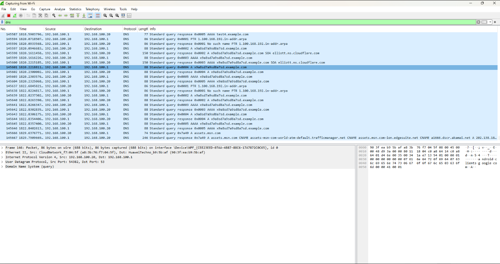

#DNS & HTTP Attacks

## Activity: Identify Suspicious DNS Traffic

### Objective
The objective of this activity is to analyze DNS traffic in Wireshark and identify suspicious-looking DNS queries.

### Tool Used
- Wireshark

### Filter Used
`dns`

### Investigation
During this activity, I captured DNS traffic using Wireshark on the Wi-Fi interface. I applied the `dns` filter to display only DNS packets.

While reviewing the traffic, I observed repeated DNS queries for the domain:

`x9a8sd7a9sd8a7sd.example.com`

This domain appears suspicious because it contains a random string of letters and numbers. Randomized domains like this are commonly associated with **Domain Generation Algorithm (DGA)** behavior, which malware may use to contact command-and-control servers.

The DNS traffic showed communication between:

- **Client:** `192.168.100.20`
- **DNS Server:** `192.168.100.1`

I also observed repeated DNS requests and responses, which can be an indicator of suspicious or automated lookup behavior.

### Screenshot

### Analysis
The domain used in this activity is a test domain, but its pattern demonstrates how suspicious DNS traffic may appear in a real investigation. Security analysts monitor DNS traffic for:

- Random-looking domain names
- Repeated DNS queries
- NXDOMAIN responses
- Unusual subdomains

### Conclusion
This activity helped me understand how to inspect DNS traffic using Wireshark and identify patterns that may indicate suspicious behavior. Monitoring DNS queries is important because attackers may abuse DNS for malware communication, tunneling, or evasion.