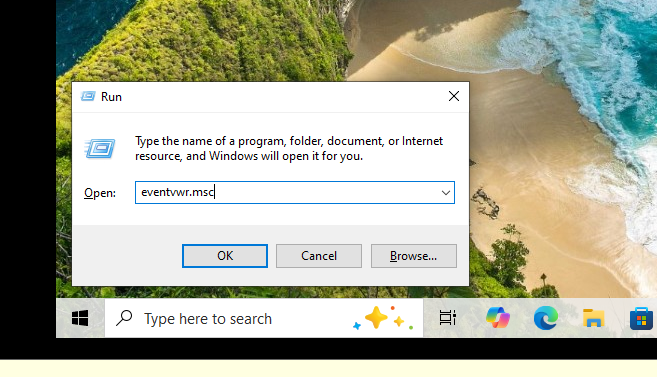
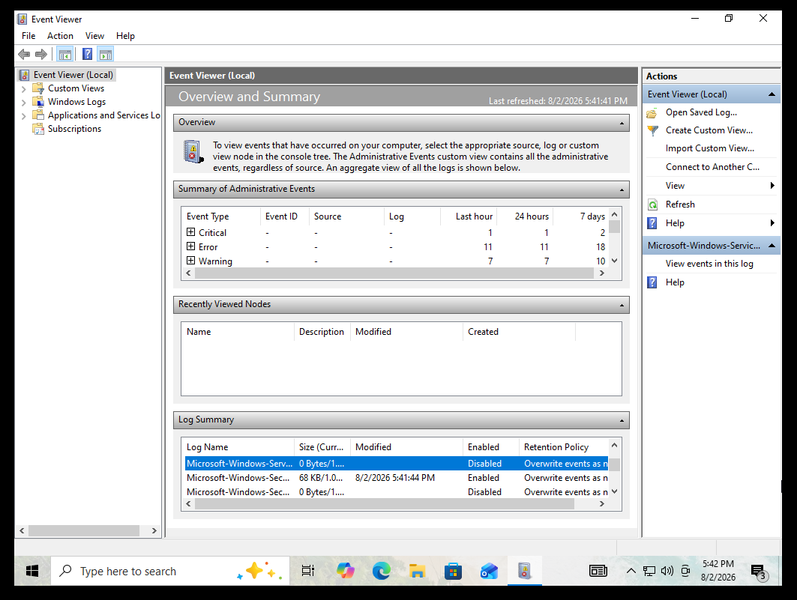
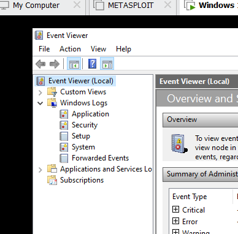
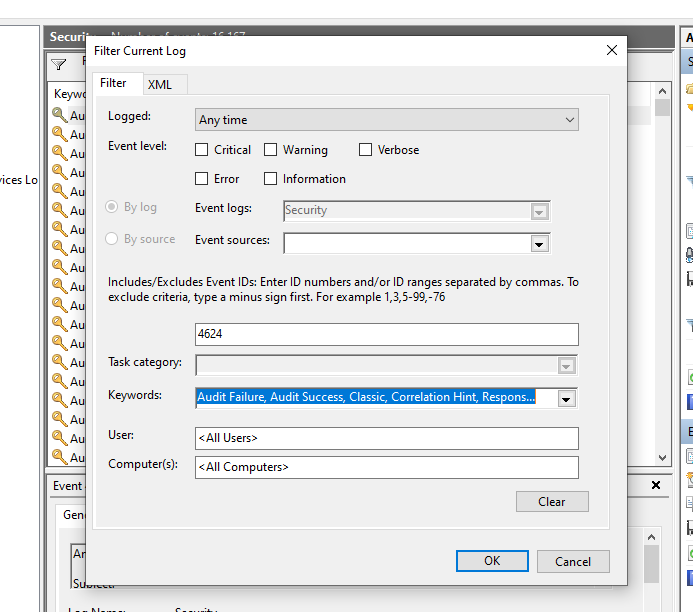
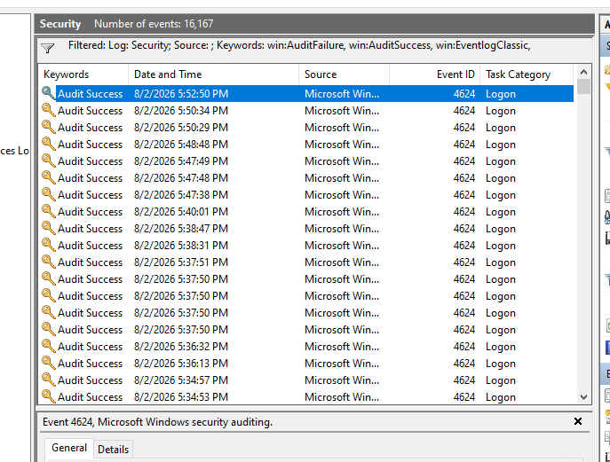
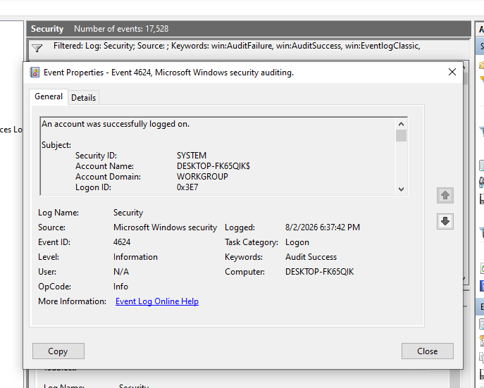
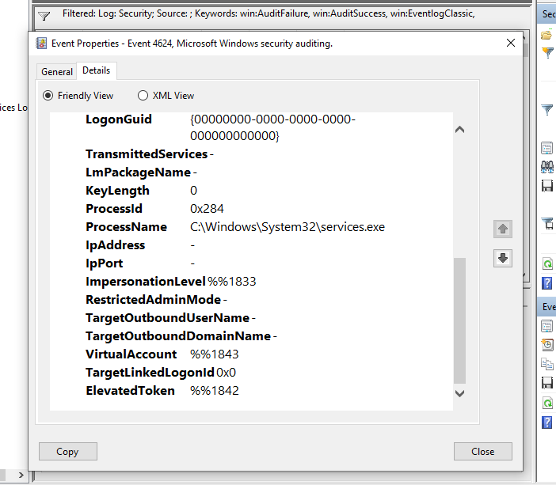
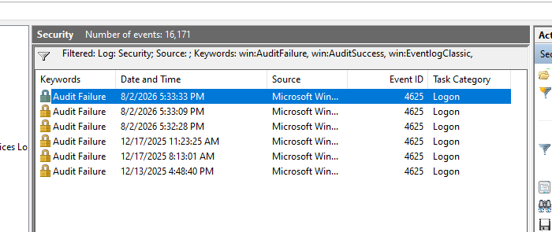
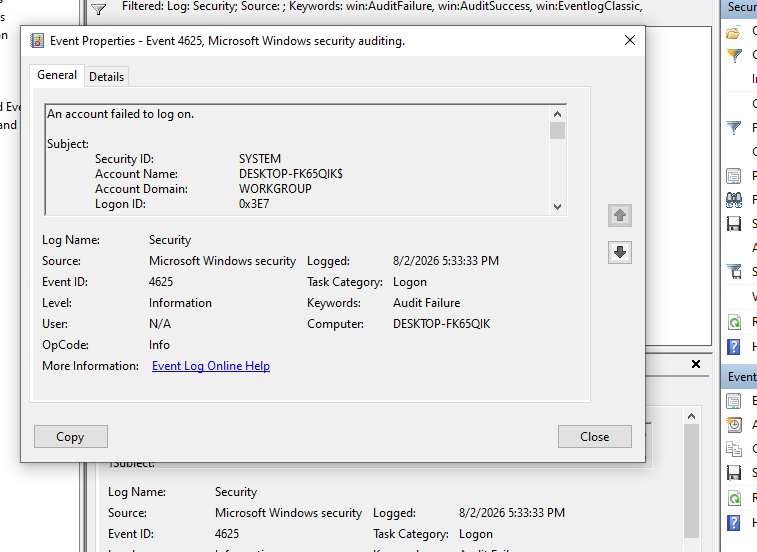

# Windows Security Event Log Analysis

## Objective

This project demonstrates how to use Windows Event Viewer to analyze Security logs and identify successful and failed logon events using Event IDs **4624** and **4625**.

---

# Lab Environment

- Windows 10
- Event Viewer
- Windows Security Logs

---

# Step 1 - Open Event Viewer

Press **Win + R**.

Type:

```
eventvwr.msc
```

Click **OK**.



---

# Step 2 - Launch Event Viewer

After opening Event Viewer, the Overview and Summary page is displayed.



---

# Step 3 - Navigate to Security Logs

Expand:

```
Windo Logs
    Security
```

This log stores authentication and security-related events.


---

# Step 4 - Open the Security Log

Select the **Security** log to display all recorded security events.



---

# Step 5 - Filter Successful Logon Events (Event ID 4624)

Click **Filter Current Log** and enter:

```
4624
```



---

# Step 6 - View Successful Logon Events

Event ID **4624** indicates that a user successfully logged on.



---

# Step 7 - Review the General Information

The **General** tab displays a summary of the successful logon event.



---

# Step 8 - Review Event Details

The **Details** tab contains additional forensic information such as:

- Logon GUID
- Process Name
- Process ID
- Authentication Package
- Logon Type
- Virtual Account



Additional Details:


---

# Step 9 - View Failed Logon Events (Event ID 4625)

Event ID **4625** indicates a failed logon attempt.



---

# Step 10 - Review Failed Logon Details

The **General** tab displays information about the failed authentication attempt.



---

# Key Event IDs

| Event ID | Description |
|----------|-------------|
| 4624 | Successful Logon |
| 4625 | Failed Logon |

---

# Skills Demonstrated

- Windows Event Viewer
- Windows Security Log Analysis
- Event Filtering
- Authentication Monitoring
- Windows Security Fundamentals
- Basic Incident Investigation

---

# Conclusion

This project demonstrates how to use Windows Event Viewer to investigate Windows Security logs. By filtering Event IDs **4624** and **4625**, successful and failed logon events can be identified and analyzed. These are fundamental skills used by SOC Analysts and Blue Team professionals during security monitoring and incident investigations.