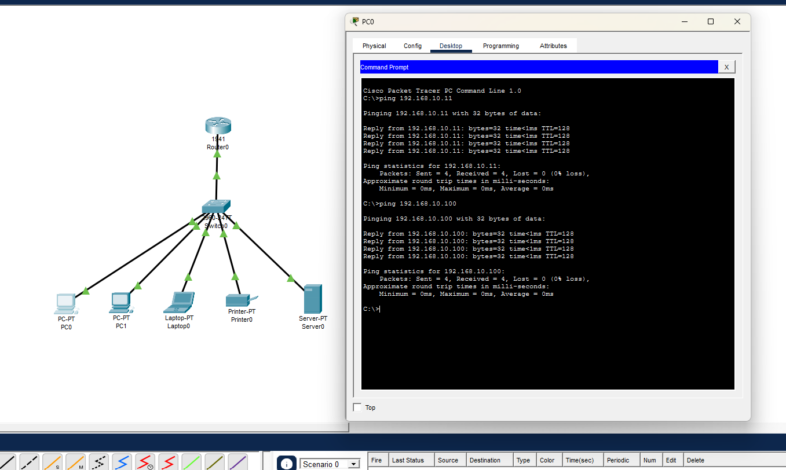

# Office Network Design using Cisco Packet Tracer

## Overview

This project simulates a small office network consisting of one router, one switch, two desktop PCs, one laptop, one printer, and one file server.

## Network Topology

## Devices

- Cisco 1941 Router
- Cisco 2960 Switch
- PC1
- PC2
- Laptop
- Printer
- File Server

## IP Addressing

| Device | IP Address |
|---------|------------|
| Router | 192.168.10.1 |
| PC1 | 192.168.10.10 |
| PC2 | 192.168.10.11 |
| Laptop | 192.168.10.12 |
| Printer | 192.168.10.20 |
| Server | 192.168.10.100 |

## Author

Dayries Mariano

## Configuration

Router Configuration

Interface: GigabitEthernet0/0

IP Address: 192.168.10.1
Subnet Mask: 255.255.255.0
Port Status: On

--------------------------------

PC1

IP Address: 192.168.10.10
Subnet Mask: 255.255.255.0
Gateway: 192.168.10.1

--------------------------------

PC2

IP Address: 192.168.10.11
Subnet Mask: 255.255.255.0
Gateway: 192.168.10.1

--------------------------------

Laptop

IP Address: 192.168.10.12
Subnet Mask: 255.255.255.0
Gateway: 192.168.10.1

--------------------------------

Printer

IP Address: 192.168.10.20
Subnet Mask: 255.255.255.0
Gateway: 192.168.10.1

--------------------------------

Server

IP Address: 192.168.10.100
Subnet Mask: 255.255.255.0
Gateway: 192.168.10.1